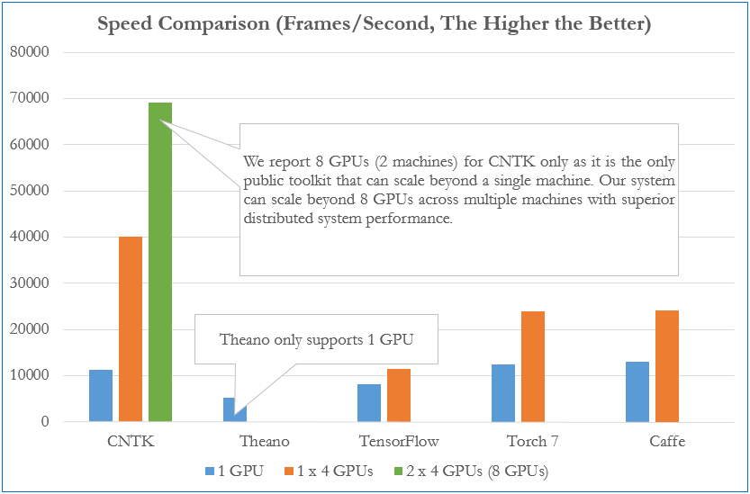

## Latest news
*2016-10-25.* New CNTK Name, new Web Site and V 2.0 Beta 1 Release  

CNTK becomes **The Microsoft Cognitive Toolkit**. See more at our [new Web Site](https://www.microsoft.com/en-us/research/product/cognitive-toolkit/).

Highlights of this Release:
* CNTK can now be used as a library with [brand new C++ and Python APIs](https://github.com/microsoft/cntk/wiki/CNTK-Library-API)
* New Python Examples and Tutorials
* Support of Fast R-CNN algorithm
* Improvements in CNTK Evaluation library including support of CNTK APIs

See more in the [Release Notes](https://github.com/Microsoft/CNTK/wiki/CNTK_2_0_beta_1_Release_Notes). You will find there links to the materials about the new features.  

*2016-10-03.* V 1.7.2 Binary release  
**This is a Hot Fix Release. It affects all users of Model Evaluation Library**

If you are NOT using Model Evaluation Library you may skip this release.  
If you ARE using Model Evaluation Library we **strongly recommend** installing version 1.7.2 instead of **any** previous version you might be using.

See [Release Notes](https://github.com/Microsoft/CNTk/wiki/CNTK_1_7_2_Release_Notes) for details.

*2016-09-28.* V 1.7.1 Binary release  
Highlights of this Release:
* Two Breaking Changes related to Layers library default initialization and ```fsAdagrad``` gradient-normalization scheme
* Improvements in BrainScript
* Enabling of Deterministic Algorithm enforcement
* Improvements in Model Evaluation including the support of Evaluation for Azure Applications
* Different Performance improvements
* Multiple bug fixes

See more in the [Release Notes](https://github.com/Microsoft/CNTK/wiki/CNTK_1_7_1_Release_Notes) (including the full list of bugs fixed)  
Get the Release from the [CNTK Releases page](https://github.com/Microsoft/CNTK/releases)

*2016-08-31.* V 1.7 Binary release  
Highlights of this Release:
* Improvements in BrainScript (New library of predefined common layer types, Support of cuDNN5 RNN and Common random-initialization types, improved handling of GRUs)
* Support of NVIDIA cuDNN 5.1
* Improvements in Readers and Deserializers
* Additions to Evaluator Library (Eval Client Sample, Strong Name for EvalWrapper)
* New in Unit Tests (Linux support, Randomization engines)
* Python API Preview (since V.1.5)
* Multiple bug fixes

See more in the [Release Notes](https://github.com/Microsoft/CNTK/wiki/CNTK_1_7_Release_Notes)  
Get the Release from the [CNTK Releases page](https://github.com/Microsoft/CNTK/releases)

*2016-08-29.* Two new Tutorials are available:  
[Image recognition](https://github.com/Microsoft/CNTK/wiki/Hands-On-Labs-Image-Recognition) (CIFAR-10) and [Language understanding](https://github.com/Microsoft/CNTK/wiki/Hands-On-Labs-Image-Recognition) (ATIS).

*2016-08-10.* We have significantly simplified handling of **Gated Recurrent Units (GRU)**. Read more in the [corresponding article](https://github.com/Microsoft/CNTK/wiki/GRUs-on-CNTK-with-BrainScript).

See [all news](https://github.com/Microsoft/CNTK/wiki/News).

## What is CNTK
CNTK (http://www.cntk.ai/), the Computational Network Toolkit by Microsoft Research, is a unified deep-learning toolkit that describes neural networks as a series of computational steps via a directed graph. In this directed graph, leaf nodes represent input values or network parameters, while other nodes represent matrix operations upon their inputs. CNTK allows to easily realize and combine popular model types such as feed-forward DNNs, convolutional nets (CNNs), and recurrent networks (RNNs/LSTMs). It implements stochastic gradient descent (SGD, error backpropagation) learning with automatic differentiation and parallelization across multiple GPUs and servers. CNTK has been available under an open-source license since April 2015. It is our hope that the community will take advantage of CNTK to share ideas more quickly through the exchange of open source working code.

Wiki: Go to the [CNTK Wiki](https://github.com/Microsoft/CNTK/wiki) for all information on CNTK including [setup](https://github.com/Microsoft/CNTK/wiki/Setup-CNTK-on-your-machine ), [examples](https://github.com/Microsoft/CNTK/wiki/Examples ), etc.

License: See [LICENSE.md](./LICENSE.md) in the root of this repository for the full license information.

Tutorial: [Microsoft Computational Network Toolkit (CNTK) @ NIPS 2015 Workshops](http://research.microsoft.com/en-us/um/people/dongyu/CNTK-Tutorial-NIPS2015.pdf)

Blogs:  

* [Microsoft Computational Network Toolkit offers most efficient distributed deep learning computational performance](http://blogs.technet.com/b/inside_microsoft_research/archive/2015/12/07/microsoft-computational-network-toolkit-offers-most-efficient-distributed-deep-learning-computational-performance.aspx)
* [Microsoft researchers win ImageNet computer vision challenge (December 2015)](http://blogs.microsoft.com/next/2015/12/10/microsoft-researchers-win-imagenet-computer-vision-challenge/)

## Performance

The figure below compares processing speed (frames processed per second) of CNTK to that of four other well-known toolkits. The configuration uses a fully connected 4-layer neural network (see our benchmark [scripts](https://github.com/Alexey-Kamenev/Benchmarks)) and an effective mini batch size (8192). All results were obtained on the same hardware with the respective latest public software versions as of Dec 3, 2015.



## Citation

If you used this toolkit or part of it to do your research, please cite the work as:

Amit Agarwal, Eldar Akchurin, Chris Basoglu, Guoguo Chen, Scott Cyphers, Jasha Droppo, Adam Eversole, Brian Guenter, Mark Hillebrand, T. Ryan Hoens, Xuedong Huang, Zhiheng Huang, Vladimir Ivanov, Alexey Kamenev, Philipp Kranen, Oleksii Kuchaiev, Wolfgang Manousek, Avner May, Bhaskar Mitra, Olivier Nano, Gaizka Navarro, Alexey Orlov, Hari Parthasarathi, Baolin Peng, Marko Radmilac, Alexey Reznichenko, Frank Seide, Michael L. Seltzer, Malcolm Slaney, Andreas Stolcke, Huaming Wang, Yongqiang Wang, Kaisheng Yao, Dong Yu, Yu Zhang, Geoffrey Zweig (in alphabetical order), ["An Introduction to Computational Networks and the Computational Network Toolkit"](http://research.microsoft.com/apps/pubs/?id=226641), Microsoft Technical Report MSR-TR-2014-112, 2014.

## Disclaimer 

CNTK is in active use at Microsoft and constantly evolving. There will be bugs.


## Microsoft Open Source Code of Conduct

This project has adopted the [Microsoft Open Source Code of Conduct](https://opensource.microsoft.com/codeofconduct/). For more information see the [Code of Conduct FAQ](https://opensource.microsoft.com/codeofconduct/faq/) or contact [opencode@microsoft.com](mailto:opencode@microsoft.com) with any additional questions or comments.
